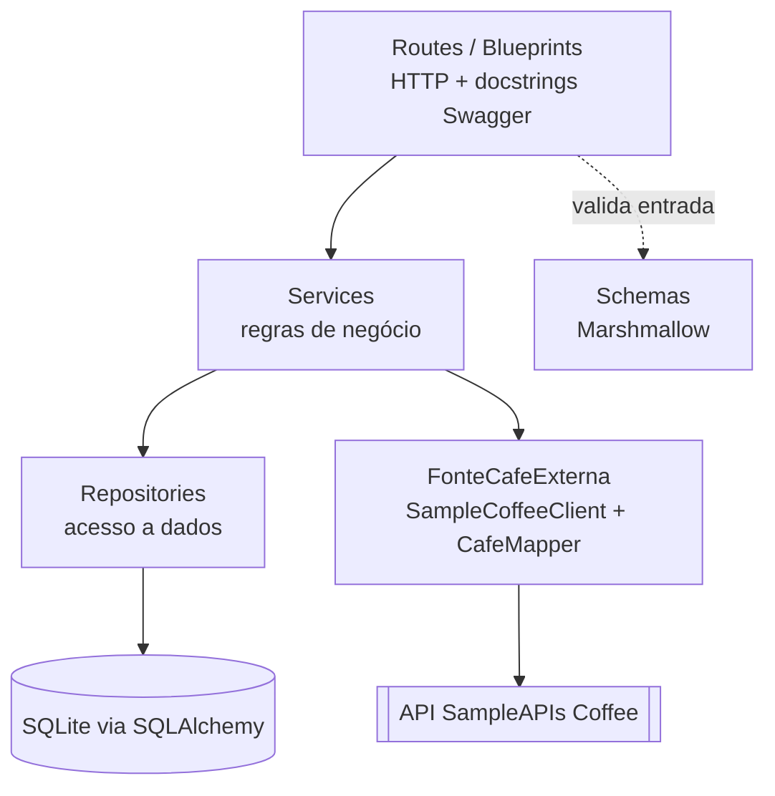
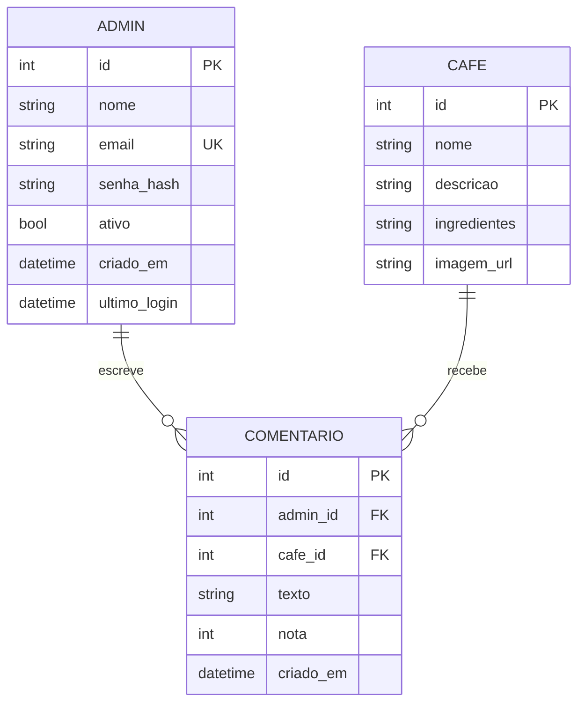

# Rest API - Café Explorer (MVP)

API REST em **Python + Flask** com persistência em **SQLite (SQLAlchemy)**, documentação **Swagger (Flasgger)** e integração com um serviço externo, a **SampleAPIs Coffee** (<https://api.sampleapis.com/api-list/coffee>). O projeto foi organizado em camadas seguindo os princípios **SOLID** e possui validação de entrada e proteção contra SQL injection.

## Sumário

1. [Visão geral](#1-visão-geral)
2. [Tecnologias](#2-tecnologias)
3. [Arquitetura e SOLID](#3-arquitetura-e-solid)
4. [Modelo de dados](#4-modelo-de-dados)
5. [Endpoints](#5-endpoints)
6. [Integração com a SampleAPIs Coffee](#6-integração-com-a-sampleapis-coffee)
7. [Como executar](#7-como-executar)
8. [Estrutura de pastas](#8-estrutura-de-pastas)

---

## 1. Visão geral

A API gerencia três entidades: **Cafe**, **Comentario** e **Admin**.

- O **público** consulta cafés (`GET`) e comentários (`GET`). A consulta de cafés combina o banco local (SQLite) com a SampleAPIs Coffee: os itens externos que não existem no banco local são **concatenados** ao resultado.
- O **Admin** (autenticado por token JWT) cria, consulta, altera e remove cafés (`POST`, `GET`, `PUT`, `DELETE`) e escreve **comentários** (com nota de 1 a 5) sobre os cafés do banco local — o autor do comentário é sempre o Admin autenticado no token, nunca informado no corpo da requisição.
- Os itens da SampleAPIs Coffee são **apenas exibidos** nas consultas: nunca são gravados no SQLite.

## 2. Tecnologias

| Item | Uso |
| --- | --- |
| Python 3.12 | Linguagem |
| Flask | Framework web (application factory + blueprints) |
| Flask-SQLAlchemy / SQLAlchemy | ORM e acesso ao SQLite |
| Marshmallow | Validação e serialização de dados |
| Flasgger | Swagger UI e especificação OpenAPI |
| requests (+ urllib3 Retry) | Cliente HTTP da SampleAPIs Coffee |
| Flask-JWT-Extended | Autenticação do Admin por JWT |
| Flask-Limiter | Rate limiting |
| Flask-CORS | CORS configurável |
| bleach | Sanitização de HTML em textos |
| Gunicorn | Servidor de produção (Docker) |

## 3. Arquitetura e SOLID



Cada camada só conhece a de baixo, por meio de abstrações:

| Princípio | Como foi aplicado |
| --- | --- |
| **S** — Responsabilidade única | Route só trata HTTP; Service só aplica regras; Repository só acessa o banco; Client só fala com a API externa; Schema só valida; Mapper só converte campos; `AuthService` só cuida de autenticação. |
| **O** — Aberto/fechado | Novas fontes externas entram como novas implementações de `FonteCafeExterna`, sem alterar o `CafeService`. Novos filtros/colunas se declaram nas subclasses de repositório. |
| **L** — Substituição de Liskov | Qualquer implementação de `RepositorioBase` pode substituir a do SQLAlchemy sem quebrar os services. |
| **I** — Segregação de interfaces | Interfaces pequenas: `RepositorioBase` (CRUD) e `FonteCafeExterna` (apenas leitura: `list` e `get`). |
| **D** — Inversão de dependência | Os services recebem repositórios e fonte externa no construtor. A montagem acontece em um único lugar, `app/container.py`. |

Outras decisões: *application factory* (`create_app`), configuração por variáveis de ambiente, exceções de domínio (`NaoEncontradoError`, `ConflitoError`, ...) convertidas em JSON padronizado por um handler global.

## 4. Modelo de dados



**Cafe** (campos em português; `id` autoincremento) — alinhado ao formato da SampleAPIs Coffee:

| Campo | Tipo | Regra |
| --- | --- | --- |
| nome | texto (2–120) | obrigatório |
| descricao | texto (até 2000) | opcional |
| ingredientes | lista de textos (até 20 itens, 120 caracteres cada); guardada no banco como texto separado por vírgula | opcional |
| imagem_url | URL http/https (até 500) | opcional |

> A tabela `cafe` mudou de estrutura (não tem mais `preco`, `regiao`, `peso`, `perfil_sabor`, `opcao_moagem` nem `nivel_torra`), porque a nova fonte externa não fornece esses dados. Veja a [seção 11](#11-decisões-de-projeto-e-limitações).

**Comentario:** `admin_id` (autor, preenchido a partir do token — nunca vem do corpo da requisição), `cafe_id` (café do banco local), `texto` (1–1000) e `nota` (1–5). **Admin:** `nome`, `email` (único), `senha_hash`, `ativo`, `criado_em`, `ultimo_login`.

Ao excluir um admin ou um café, os comentários relacionados são removidos em cascata.

## 5. Endpoints

A documentação interativa fica em **`/apidocs/`** (Swagger UI). Para rotas de Admin, use o botão **Authorize** e informe `Bearer <token>`.

| Recurso | Método e rota | Acesso | Descrição |
| --- | --- | --- | --- |
| Café | `GET /api/v1/cafes` | Público | Lista cafés: banco local + SampleAPIs Coffee (`?incluir_externos=false` = só local) |
| Café | `GET /api/v1/cafes/{id}` | Público | Busca um café (`?origem=auto\|local\|externa`; padrão local e, se não achar, SampleAPIs Coffee) |
| Admin | `POST /api/v1/admin/auth/login` | Público | Login, devolve o token JWT |
| Admin | `GET /api/v1/admin/me` | Admin | Dados do admin autenticado |
| Café | `POST /api/v1/cafes` | Admin | Cria café |
| Café | `PUT /api/v1/cafes/{id}` | Admin | Substitui os dados do café |
| Café | `DELETE /api/v1/cafes/{id}` | Admin | Remove o café (e seus comentários) |
| Comentário | `POST /api/v1/comentarios` | Admin | Cria comentário (autor = admin do token) |
| Comentário | `GET /api/v1/comentarios`, `GET /api/v1/comentarios/{id}` | Público | Lista/busca comentários (filtros `cafe_id`, `admin_id`) |
| Comentário | `PUT/DELETE /api/v1/comentarios/{id}` | Público | Atualiza/remove um comentário |
| Healthcheck | `GET /api/v1/healthcheck` | Público | Verifica API e banco |

Regras gerais:

- **Listagens** aceitam `pagina`, `por_pagina` (máx. 100), `ordenar_por` (`id` ou `nome`) e `direcao` (`asc`/`desc`), e respondem `{"itens": [...], "total": N, "pagina": 1, "por_pagina": 20}`.
- **Códigos HTTP:** 200, 201, 204, 400 (corpo inválido), 401 (sem token/credenciais), 403 (sem permissão), 404, 409 (conflito, como e-mail duplicado), 413, 422 (validação) e 502 (SampleAPIs Coffee indisponível quando a consulta externa é indispensável).
- **Erros** seguem sempre o formato `{"erro": {"codigo": "...", "mensagem": "...", "detalhes": {...}}}`.
- **PUT** substitui o recurso: campos opcionais omitidos voltam a ficar vazios. No comentário, só `texto` e `nota` podem ser alterados.

## 6. Integração com a SampleAPIs Coffee

A fonte externa (<https://api.sampleapis.com/api-list/coffee>) expõe dois endpoints, **sem endpoint por id**:

- `GET https://api.sampleapis.com/coffee/hot` — cafés quentes
- `GET https://api.sampleapis.com/coffee/iced` — cafés gelados

Cada item vem no formato:

```json
{
  "title": "Latte",
  "description": "...",
  "ingredients": ["Espresso", "Steamed milk"],
  "image": "https://...",
  "id": 2
}
```

Este projeto **não diferencia** quente/gelado: toda consulta busca os dois endpoints e junta o resultado, conforme definido no escopo.

### Regra do `GET /api/v1/cafes`

1. Busca os cafés no SQLite (aplicando filtros e ordenação).
2. Consulta a SampleAPIs Coffee — `hot` e `iced` (timeout de 5 s e 1 nova tentativa cada).
3. Converte os itens externos com o **Mapper** e acrescenta apenas os que **não existem** no banco local. A comparação é pelo **nome normalizado** (minúsculas, sem acentos e sem espaços extras), porque os ids das duas bases não coincidem.
4. Cada item traz `origem` (`local` ou `externa`). Em conflito, o **dado local prevalece**. Itens externos vêm com `id: null` e o id da fonte em `id_externo`.
5. O campo `fonte_externa` informa o estado da consulta: `disponivel`, `indisponivel` (a API caiu: a resposta traz só dados locais, sem erro 500) ou `desativada` (`?incluir_externos=false`).

### Detalhe por id

`GET /api/v1/cafes/{id}` usa `origem=auto` por padrão: procura no banco local e, se não achar, consulta a SampleAPIs Coffee. Como os ids locais e externos são independentes, use `?origem=externa` com o `id_externo` para buscar diretamente um item da fonte, ou `?origem=local` para restringir ao banco.

> **Limitação conhecida:** como a fonte não expõe um endpoint por id nem diferencia hot/iced neste projeto, o mesmo id pode existir nos dois grupos (por exemplo, `id=2` em "hot" e `id=2` em "iced" são cafés diferentes). Nesse caso, `origem=externa` devolve o **primeiro encontrado** (a lista "hot" é buscada antes da "iced").

> **Qualidade dos dados da fonte externa:** a SampleAPIs Coffee já devolveu, em `/coffee/hot`, alguns itens com o campo `id` **fora do padrão** (texto em vez de número, ex.: `"number"` ou `"123456"`). O `CafeMapper` normaliza esse valor: se converter para inteiro, vira `id_externo` normalmente; caso contrário, `id_externo` fica `null` e o item é tratado como sem id (não afeta `nome`, `descricao`, `ingredientes` nem `imagem_url`, que continuam exibidos normalmente). Isso evita que um dado malformado da fonte externa quebre a ordenação ou a listagem.

### Mapper: equivalência de campos

O `CafeMapper` (`app/clients/cafe_mapper.py`) concentra a correspondência entre os nossos campos (português) e os da SampleAPIs Coffee (inglês) no dicionário `EQUIVALENCIA_CAMPOS`:

| Campo local | Campo da SampleAPIs Coffee |
| --- | --- |
| nome | title |
| descricao | description |
| ingredientes | ingredients |
| imagem_url | image |

Se a fonte externa mudar um nome de campo, basta alterar o dicionário. A SampleAPIs Coffee só é acessada por leitura (`GET`); a escrita acontece apenas no nosso banco.

## 7. Como executar

### Variáveis de ambiente

Copie `.env.example` para `.env` e ajuste.

| Variável | Descrição | Padrão |
| --- | --- | --- |
| `APP_ENV` | `development` ou `production` (exige os três segredos abaixo) | `development` |
| `JWT_SECRET_KEY` | Segredo dos tokens JWT | aleatório por processo em desenvolvimento |
| `ADMIN_EMAIL` / `ADMIN_SENHA` | Admin criado automaticamente (seed). Senha com 8+ caracteres, letras e números | nenhum admin é criado se ausentes |
| `ADMIN_NOME` | Nome do admin do seed | `Administrador` |
| `DATABASE_URL` | URL do banco | `sqlite` em `instance/cafes.db` |
| `SAMPLECOFFEE_URL`, `SAMPLECOFFEE_TIMEOUT`, `SAMPLECOFFEE_RETRIES` | Integração externa (base; `/hot` e `/iced` são anexados automaticamente) | `https://api.sampleapis.com/coffee`, 5 s, 1 |
| `JWT_EXPIRA_MINUTOS` | Validade do token | 30 |
| `RATELIMIT_DEFAULT`, `RATELIMIT_LOGIN` | Limites de requisições | `100 per minute`, `5 per minute` |
| `CORS_ORIGINS` | Origens permitidas, separadas por vírgula | vazio (desligado) |

> **Se você já tem um `instance/cafes.db` de uma versão anterior**, apague-o antes de subir a API: as tabelas `cafe` e `comentario` mudaram de colunas (e a tabela `usuario` foi removida) e o projeto não usa migrações (cria as tabelas do zero com `db.create_all()`). Pare o processo da API antes de apagar o arquivo — no Windows, o SQLite fica bloqueado enquanto o processo está rodando.

### Localmente

```bash
python -m venv .venv
source .venv/bin/activate          # Windows: .venv\Scripts\activate
pip install -r requirements.txt
cp .env.example .env               # Windows: copy .env.example .env
python run.py
```

A API sobe em <http://127.0.0.1:5000> e o Swagger em <http://127.0.0.1:5000/apidocs/>. As tabelas e o admin inicial são criados automaticamente.

### Com Docker

```bash
docker build -t cafe-api .

docker run -d --name cafe-api -p 5000:5000 \
  -e JWT_SECRET_KEY="troque-por-um-segredo-longo" \
  -e ADMIN_EMAIL="admin@exemplo.com" \
  -e ADMIN_SENHA="SenhaForte123" \
  -v cafe-data:/app/instance \
  cafe-api
```

Ou, com um arquivo `.env`: `docker run -d -p 5000:5000 --env-file .env -v cafe-data:/app/instance cafe-api`.

O volume `cafe-data` guarda o arquivo SQLite, então os dados sobrevivem à remoção do container. Em `APP_ENV=production` (padrão da imagem) a aplicação não inicia sem `JWT_SECRET_KEY`, `ADMIN_EMAIL` e `ADMIN_SENHA`. Logs: `docker logs cafe-api`.

## 8. Estrutura de pastas

```text
rest-api-mvp-arquitetura-software/
├── app/
│   ├── __init__.py            # application factory (create_app)
│   ├── config.py              # configuração por variáveis de ambiente
│   ├── container.py           # montagem das dependências (injeção)
│   ├── extensions.py          # db, jwt, limiter, swagger
│   ├── swagger_docs.py        # definições compartilhadas do Swagger
│   ├── models/                # Cafe, Comentario, Admin (SQLAlchemy)
│   ├── schemas/                # validação e serialização (Marshmallow)
│   ├── repositories/           # RepositorioBase + implementação SQLAlchemy
│   ├── services/               # regras de negócio
│   ├── clients/                # FonteCafeExterna, SampleCoffeeClient e CafeMapper
│   ├── routes/                 # blueprints com docstrings Swagger
│   ├── errors/                 # exceções de domínio e handlers
│   └── utils/                  # utilitários (normalização de texto)
├── instance/                  # banco SQLite (volume no Docker)
├── run.py                     # ponto de entrada
├── requirements.txt
├── Dockerfile
├── .dockerignore
├── .env.example
└── README.md
```

## Autor

- Jonathan Greco Leite [@jonathan-greco](https://www.github.com/jonathan-greco)

Repositório do projeto MVP Arquitetura de Software de Pós-graduação de Engenharia de Software, em 2026, da PUC-Rio.
